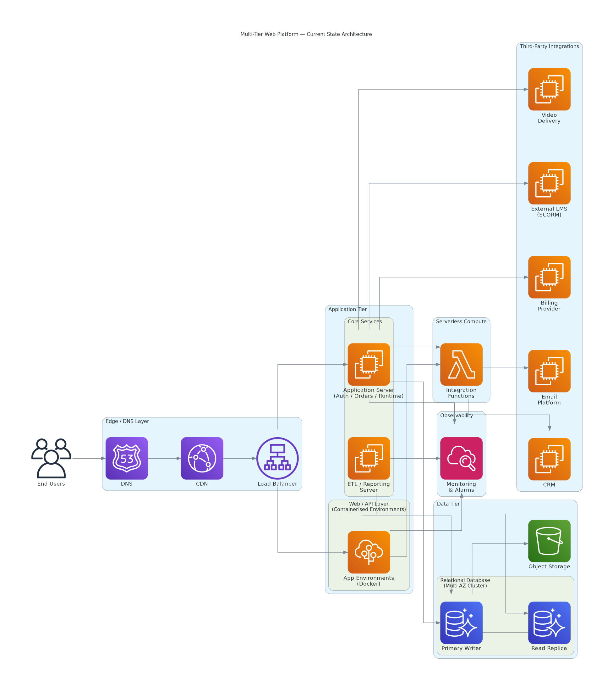

# Platform Architecture Documentation

Current-state cloud platform architecture for a SaaS continuing education provider, covering frontend, identity, billing, operational data, integrations, and security boundaries.

---

## Overview

This project documents the current-state architecture of a SaaS education platform running on AWS. The documentation was created to give engineering, product, and executive stakeholders a shared, accurate view of how the platform is built, not an idealized future state, but what actually exists and runs today.

Diagrams are built in Eraser.io and reflect actual services, connectivity patterns, and security boundaries.

---

## Architecture Components

### Frontend & API
- Public-facing web application served via CDN (CloudFront)
- Application servers behind a load balancer (ALB)
- API layer handling course delivery, user sessions, and orders

### Identity & Auth
- Identity, authentication, and order processing handled by a dedicated application layer
- Integrates with the main platform for session management

### Billing & Payments
- Subscription billing via third-party recurring billing platform
- Payment processing via external payment gateway

### Operational Database
- Central MySQL-compatible Aurora cluster (multi-AZ, writer + reader)
- Serves as the operational hub for user data, course completions, and subscription records
- Separate legacy database still read by reporting pipelines

### Serverless Layer
- AWS Lambda functions handling async workflows, webhooks, and integrations
- 100+ functions across multiple Node.js runtimes (remediation in progress)

### External Integrations
- **CRM:** Salesforce (contact and account sync)
- **Email Marketing:** Iterable (transactional and marketing emails)
- **Video Delivery:** Kaltura
- **Assessments:** Alchemer (post-tests, surveys)
- **Reporting / ETL:** Informer reads from both database sources → ETL → operational database

### Enterprise B2B
- SCORM content delivery via Rustici engine
- Supports client LMS integrations for enterprise customers

### Hosting
- Primary region: AWS us-east-1
- Elastic Beanstalk (AL2 and legacy AL1, remediation in progress)
- EC2, RDS/Aurora, Lambda, S3, CloudFront, Route 53

---

## Security Boundaries (Current State)

| Layer | Current State | Gap / Status |
|---|---|---|
| Database access | Mix of public and private | Public RDS instances being remediated |
| WAF | Not deployed | Internet-facing ALB/CloudFront exposed |
| MFA | Partially enforced | IAM hardening in progress |
| Encryption at rest | EBS volumes unencrypted | EBS encryption migration in progress |
| VPN | Client VPN available | Certificate renewal in progress |

---

## Repository Structure

```
platform-architecture-docs/
├── README.md
├── diagrams/
│   ├── current-state-architecture.png
│   ├── data-flow-overview.png
│   └── security-boundaries.png
├── components/
│   ├── frontend-and-api.md
│   ├── identity-and-auth.md
│   ├── database-layer.md
│   ├── serverless-layer.md
│   └── integrations.md
└── decisions/
    └── architecture-notes.md
```

---

## Tech Stack

- AWS (CloudFront, ALB, EC2, Elastic Beanstalk, RDS/Aurora, Lambda, S3, VPC, IAM)
- Eraser.io (architecture diagramming)
- Salesforce, Iterable, Kaltura, Alchemer, Rustici SCORM

> All account identifiers, internal naming, and client-specific details have been removed.


## Architecture Diagram



